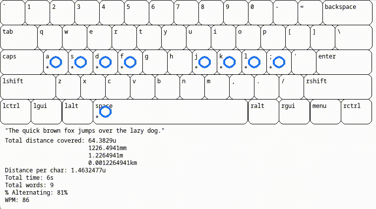

# layout-speed
This is a program for generating statistics and visualizations of typing texts using different keyboard layouts.

# About
The initial motivation for making this was [Matt Parker's video](https://www.youtube.com/watch?v=Mf2H9WZSIyw) on the longest English word in terms of finger movement when typing with a single finger. I was curious what the longest word would be if you touch typed and so I wrote this. In addition to calculating how "long" different words are, this program also measures how much a layout facilitates alternating between hands and words per minute (given how fast your fingers move).

# Usage
So far, this includes the QWERTY, Dvorak and Colemak layouts, as well as the text of Alice's Adventures in Wonderland and a newline-separated file of all English words
## Options
**-l** - Specify the layout file to use, defaults to qwerty
**-t** - A string to simulate
**-f** - A file with text to simulate, mutually exclusive with **-t**
**-p** - true or false, whether to run the simulation in parallel
**-c** - Compare each line of the given file and output the longest
**-n** - Don't display any visualization, just output stats
